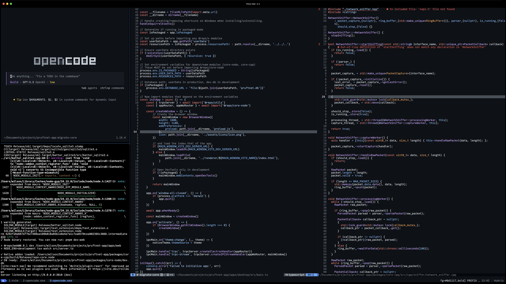
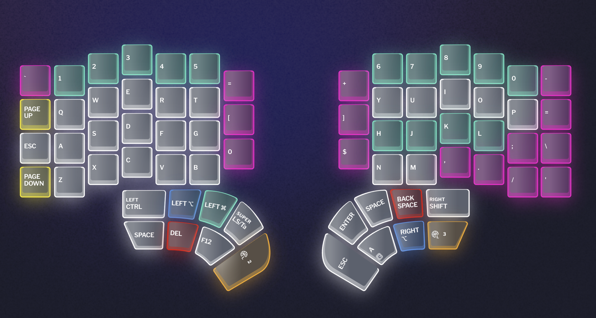

# Development Environment

This repository contains a macOS terminal development setup built around Neovim, tmux, Ghostty, AeroSpace and the config for my split-keyboard Dygma Defy.





| Layer     | Responsibility                        | Main keys                 |
| --------- | ------------------------------------- | ------------------------- |
| AeroSpace | macOS windows and workspaces          | `cmd-*`                   |
| Ghostty   | Terminal rendering                    | no custom navigation keys |
| tmux      | Terminal sessions, windows, and panes | `C-a`, `C-h/j/k/l`        |
| Neovim    | Editing, buffers, splits, LSP         | `<leader>`, `C-h/j/k/l`   |
| Split Kb  | Backup for the Kb Config              |                           |

## Requirements

```sh
brew install neovim tmux ripgrep fd lazygit
brew install --cask ghostty nikitabobko/tap/aerospace
```

Recommended optional tools:

```sh
brew install make gcc tree-sitter stylua
```

This setup is tested with Neovim `0.12.2`.

## Installation

Clone this repository to the Neovim config directory:

```sh
git clone <repo-url> ~/.config/nvim
```

Install all managed configs:

```sh
~/.config/nvim/scripts/setup.sh --install
```

Existing destination files are backed up during `--install`.

## Updating Installed Configs

After editing files in the repository, apply them to the system locations with:

```sh
~/.config/nvim/scripts/setup.sh --update
```

This copies tmux, AeroSpace, and Ghostty configs to their runtime locations, reloads AeroSpace when available, and reloads tmux when a tmux server is running.

## Syncing Runtime Configs Back

If you edit runtime files directly and want to bring them back into the repository, run:

```sh
~/.config/nvim/scripts/setup.sh --sync-from-system
```

| Runtime source         | Repository destination     |
| ---------------------- | -------------------------- |
| `~/.tmux.conf`         | `tmux/tmux.conf`           |
| `~/.aerospace.toml`    | `aerospace/aerospace.toml` |
| Ghostty runtime config | `ghostty/config`           |

## Checking The Setup

```sh
~/.config/nvim/scripts/setup.sh --check
```

This verifies basic tool availability and validates Neovim and tmux config loading.

## Repository Structure

```txt
init.lua
lua/config/options.lua
lua/config/keymaps.lua
lua/config/autocmds.lua
lua/config/lazy.lua
lua/plugins/*.lua
tmux/tmux.conf
aerospace/aerospace.toml
ghostty/config
scripts/setup.sh
```

Plugin specs live in `lua/plugins/*.lua` and are loaded by `lazy.nvim`.

Useful commands:

| Command        | Description                  |
| -------------- | ---------------------------- |
| `:Lazy`        | Manage plugins               |
| `:Mason`       | Manage LSP servers and tools |
| `:checkhealth` | Diagnose Neovim setup        |

## Navigation Model

Use `cmd-*` outside the terminal and `C-h/j/k/l` inside the terminal.

This keeps AeroSpace, tmux, and Neovim from fighting over the same shortcuts.

## AeroSpace

| Key              | Action                   |
| ---------------- | ------------------------ |
| `cmd-h`          | Focus window left        |
| `cmd-j`          | Focus window down        |
| `cmd-k`          | Focus window up          |
| `cmd-l`          | Focus window right       |
| `cmd-shift-h`    | Move window left         |
| `cmd-shift-j`    | Move window down         |
| `cmd-shift-k`    | Move window up           |
| `cmd-shift-l`    | Move window right        |
| `cmd-1..8`       | Switch workspace         |
| `cmd-shift-1..8` | Move window to workspace |
| `cmd-/`          | Toggle tiles layout      |
| `cmd-,`          | Toggle accordion layout  |
| `cmd-tab`        | Previous workspace       |
| `cmd-shift-;`    | Service mode             |

Ghostty is intentionally not forced to floating mode. It is managed as a tiled AeroSpace window.

## tmux

Prefix key:

```txt
C-a
```

| Key           | Action                     |                         |
| ------------- | -------------------------- | ----------------------- |
| `C-a          | `                          | Split pane horizontally |
| `C-a -`       | Split pane vertically      |                         |
| `C-a c`       | New window in current path |                         |
| `C-a z`       | Zoom current pane          |                         |
| `C-a r`       | Reload tmux config         |                         |
| `C-a [`       | Enter copy mode            |                         |
| `C-a ]`       | Paste tmux buffer          |                         |
| `C-a H/J/K/L` | Resize pane                |                         |

Pane navigation:

| Key   | Action     |
| ----- | ---------- |
| `C-h` | Move left  |
| `C-j` | Move down  |
| `C-k` | Move up    |
| `C-l` | Move right |

The same `C-h/j/k/l` keys move between tmux panes and Neovim splits through `vim-tmux-navigator`.

Copy mode uses vi keys:

| Key       | Action          |
| --------- | --------------- |
| `C-a [`   | Enter copy mode |
| `h/j/k/l` | Move cursor     |
| `/`       | Search forward  |
| `?`       | Search backward |
| `v`       | Start selection |
| `y`       | Copy selection  |

## Neovim

| Key                | Action                            |
| ------------------ | --------------------------------- |
| `<leader>`         | Space                             |
| `C-h/j/k/l`        | Move between splits or tmux panes |
| `<leader><leader>` | Find open buffers                 |
| `<leader>sf`       | Find files                        |
| `<leader>sg`       | Live grep                         |
| `<leader>/`        | Search in current buffer          |
| `<leader>sd`       | Search diagnostics                |
| `<leader>f`        | Format buffer                     |
| `<leader>tt`       | Toggle floating terminal          |
| `<Esc><Esc>`       | Exit terminal mode                |

Line numbers are absolute and relative by default.

## Floating Terminal

The floating terminal is provided by `toggleterm.nvim`.

Use:

```txt
<leader>tt
```

Inside the terminal, use this to return to Neovim normal mode:

```txt
<Esc><Esc>
```

## Ghostty

Ghostty is used as the terminal emulator only.

This setup intentionally does not configure Ghostty splits or tab navigation. tmux is responsible for panes and terminal workspaces.

Ghostty config path:

```txt
~/Library/Application Support/com.mitchellh.ghostty/config
```

## Workflow

1. Open Ghostty.
2. Start or attach tmux with `tmux` or `tmux attach`.
3. Open projects in Neovim inside tmux.
4. Use AeroSpace for macOS windows and workspaces.
5. Use tmux for terminal panes and windows.
6. Use Neovim for buffers, splits, LSP, and code navigation.

## Troubleshooting

If Neovim fails to start:

```sh
nvim --headless '+checkhealth' '+qa'
```

If tmux navigation does not work:

```sh
ls ~/.tmux/plugins/vim-tmux-navigator
tmux source-file ~/.tmux.conf
```

If AeroSpace changes are not applied:

```sh
aerospace reload-config
```

If Ghostty does not pick up changes, restart Ghostty.
